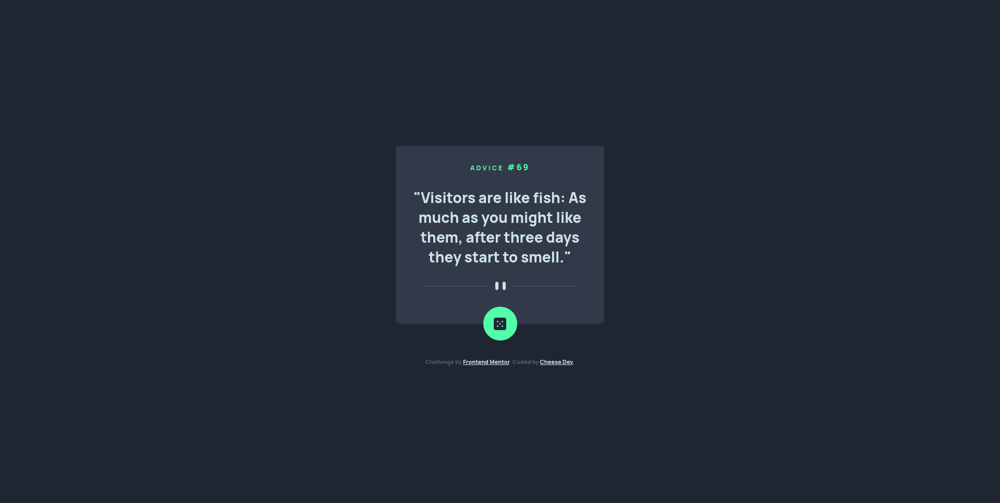

# Frontend Mentor - Advice generator app solution

This is a solution to the [Advice generator app challenge on Frontend Mentor](https://www.frontendmentor.io/challenges/advice-generator-app-QdUG-13db). Frontend Mentor challenges help you improve your coding skills by building realistic projects.

## Table of contents

- [Frontend Mentor - Advice generator app solution](#frontend-mentor---advice-generator-app-solution)
  - [Table of contents](#table-of-contents)
  - [Overview](#overview)
    - [The challenge](#the-challenge)
    - [Screenshot](#screenshot)
    - [Links](#links)
  - [My process](#my-process)
    - [Built with](#built-with)
    - [What I learned](#what-i-learned)
  - [Author](#author)
  - [Acknowledgments](#acknowledgments)

**Note: Delete this note and update the table of contents based on what sections you keep.**

## Overview

### The challenge

Users should be able to:

- View the optimal layout for the app depending on their device's screen size
- See hover states for all interactive elements on the page
- Generate a new piece of advice by clicking the dice icon

### Screenshot

### Links

- Solution URL: [Github repository](https://github.com/heloiseouvry/frontend-mentor-advice-generator)
- Live Site URL: [Portfolio](http://www.cheesedev.com/frontend-mentor/advice-generator)

## My process

### Built with

- Semantic HTML5 markup
- Flexbox
- Mobile-first workflow

### What I learned

* Code an icon button that respects accessibility concerns ([MDN reference](https://developer.mozilla.org/en-US/docs/Web/HTML/Element/button#accessibility_concerns)).
* Dealing with user-agent stylesheets
  * Remember that headers (e.g. `<h1>`) has default values (e.g. `margin`)
  * Better to use a `reset.css` to reset all of those

## Author

- Website - [Cheese Dev](http://www.cheesedev.com)
- Frontend Mentor - [@heloiseouvry](https://www.frontendmentor.io/profile/heloiseouvry)
- Github - [@heloiseouvry](https://github.com/heloiseouvry)

## Acknowledgments

Thanks to [Frontend Mentor](https://www.frontendmentor.io) for sharing those challenges!